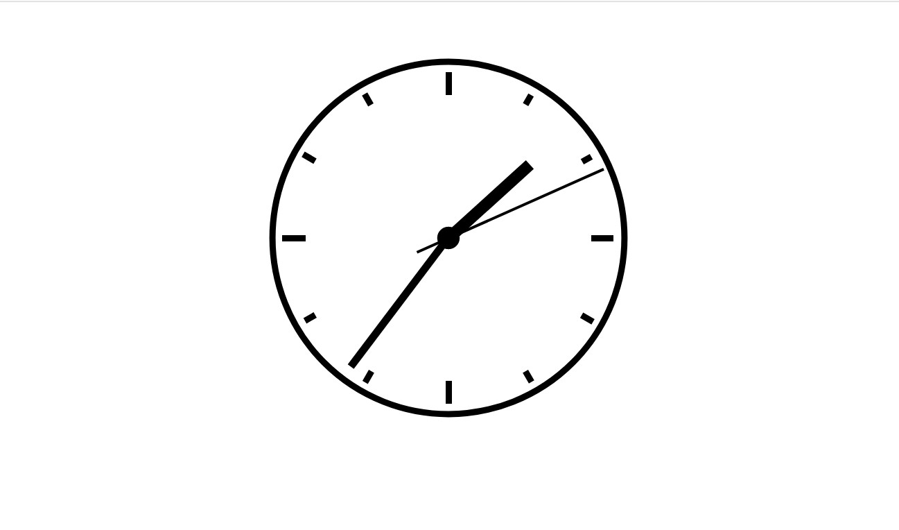

# Relogio_Analogico

 O  projeto foi feito com  JavaScript e CSS para criar um relógio analógico. Nesse projeto utilizei  objetos e métodos para determinar o horário atual, dividindo-os em horas, minutos e segundos; assim como operadores para traduzir essas informações em graus no círculo de um relógio. E por fim, as propriedades do elemento dom para posicionar os ponteiros propriamente. Tendo como resultado final: um preciso relógio analógico.

